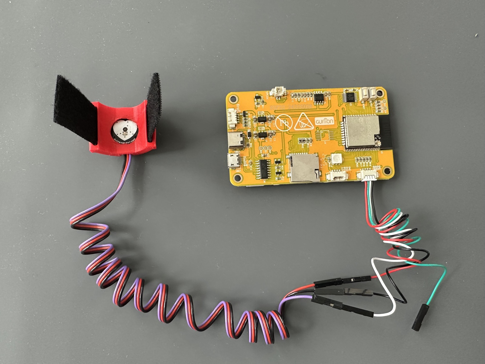
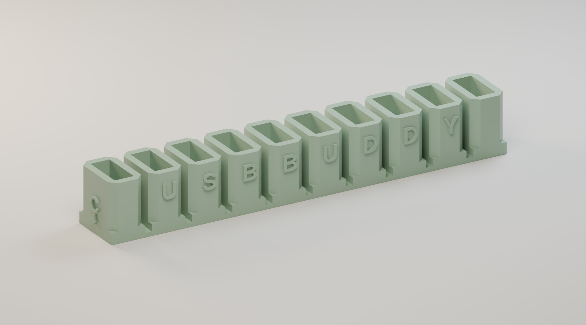
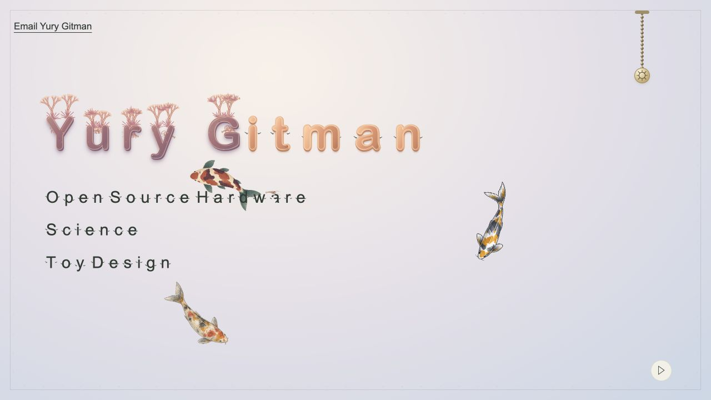

<h1>Yury Gitman</h1>

I make toys, small tools, and things that respond to a heartbeat.

<h3>On the desk</h3>
<table width="100%">
<tr>
<td width="26%"></td>
<td valign="middle"><strong><a href="https://github.com/WorldFamousElectronics/PulseSensorPlayground">PulseSensor</a></strong> Make something respond to your heartbeat.</td>
</tr>
<tr>
<td width="26%"></td>
<td valign="middle"><strong><a href="https://github.com/yury-g/usb-buddy#readme">USB Buddy</a></strong> A little order for your everyday cables.</td>
</tr>
<tr>
<td width="26%"></td>
<td valign="middle"><strong><a href="https://github.com/yury-g/cyd-kids-toy-piano">Toy Piano</a></strong> Five keys on a small screen. Something to play.</td>
</tr>
</table>

<h3>On the web</h3>
<table width="100%">
<tr>
<td width="26%"></td>
<td valign="middle"><strong><a href="https://broseph.guru">Broseph</a></strong> Warm advice from a deeply artificial individual.</td>
</tr>
<tr>
<td width="26%"></td>
<td valign="middle"><strong><a href="https://upgrademaybe.com">Upgrade, Maybe</a></strong> A closer look at your Mac before you buy another.</td>
</tr>
<tr>
<td width="26%"></td>
<td valign="middle"><strong><a href="https://yuryg.com/notes/living/">The Vibes Are People</a></strong> The people behind the moving shapes.</td>
</tr>
<tr>
<td width="26%"></td>
<td valign="middle"><strong><a href="https://yuryg.com">YuryG.com</a></strong> My home on the web.</td>
</tr>
<tr>
<td width="26%"></td>
<td valign="middle"><strong><a href="https://www.newschool.edu/parsons/faculty/yuri-gitman/">Teaching at Parsons</a></strong> Adjunct Faculty at Parsons School of Design.</td>
</tr>
</table>
